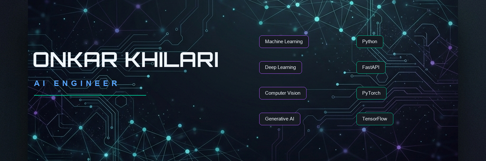

# Onkar Khilari

  

  

  <a href="mailto:onkarkhilari17@gmail.com" style="margin: 0 12px; text-decoration: none; color: #58A6FF;">
    <svg width="16" height="16" viewBox="0 0 24 24" fill="none" stroke="#58A6FF" stroke-width="2" stroke-linecap="round" stroke-linejoin="round" style="vertical-align: middle; margin-right: 4px;"><path d="M4 4h16c1.1 0 2 .9 2 2v12c0 1.1-.9 2-2 2H4c-1.1 0-2-.9-2-2V6c0-1.1.9-2 2-2z"/><polyline points="22,6 12,13 2,6"/></svg> onkarkhilari17@gmail.com
  </a>
  &middot;
  <a href="https://www.linkedin.com/in/onkar-khilari" style="margin: 0 12px; text-decoration: none; color: #58A6FF;">
    <svg width="16" height="16" viewBox="0 0 24 24" fill="none" stroke="#58A6FF" stroke-width="2" stroke-linecap="round" stroke-linejoin="round" style="vertical-align: middle; margin-right: 4px;"><path d="M16 8a6 6 0 0 1 6 6v7h-4v-7a2 2 0 0 0-2-2 2 2 0 0 0-2 2v7h-4v-7a6 6 0 0 1 6-6z"/><rect x="2" y="9" width="4" height="12"/><circle cx="4" cy="4" r="2"/></svg> LinkedIn
  </a>
  &middot;
  <a href="https://github.com/khilarionkar05" style="margin: 0 12px; text-decoration: none; color: #58A6FF;">
    <svg width="16" height="16" viewBox="0 0 24 24" fill="none" stroke="#58A6FF" stroke-width="2" stroke-linecap="round" stroke-linejoin="round" style="vertical-align: middle; margin-right: 4px;"><path d="M9 19c-5 1.5-5-2.5-7-3m14 6v-3.87a3.37 3.37 0 0 0-.94-2.61c3.14-.35 6.44-1.54 6.44-7A5.44 5.44 0 0 0 20 4.77 5.07 5.07 0 0 0 19.91 1S18.73.65 16 2.48a13.38 13.38 0 0 0-7 0C6.27.65 5.09 1 5.09 1A5.07 5.07 0 0 0 5 4.77a5.44 5.44 0 0 0-1.5 3.78c0 5.42 3.3 6.61 6.44 7A3.37 3.37 0 0 0 9 18.13V22"/></svg> GitHub
  </a>

---

## 📌 Professional Introduction

I am an Artificial Intelligence & Machine Learning specialist focused on engineering scalable, end-to-end intelligent systems. My expertise spans Deep Learning, Computer Vision, and Full Stack Engineering, allowing me to bridge the gap between complex neural architectures and production-ready applications. I design and build low-latency API pipelines using FastAPI, train robust vision models with PyTorch and TensorFlow, and integrate generative AI capabilities into modern workflows. Passionate about solving complex engineering challenges, I focus on optimizing model inference, building data ingestion pipelines, and deploying containerized solutions. I aim to build high-impact, robust systems that leverage state-of-the-art AI to address critical business and scientific challenges.

### 🎯 Career Objective

> "To architect and deploy scalable, production-ready AI systems at a world-class technology company, leveraging computer vision and generative models to build intelligent software that solves complex real-world challenges."

---

## ⚡ Quick Information

<table width="100%">
  <tr>
    <td width="50%" valign="top">
      <h4>
        <svg width="18" height="18" viewBox="0 0 24 24" fill="none" stroke="#58A6FF" stroke-width="2" stroke-linecap="round" stroke-linejoin="round" style="vertical-align: middle; margin-right: 6px;"><path d="M22 10v6M2 10l10-5 10 5-10 5z"/><path d="M6 12v5c0 2 2 3 6 3s6-1 6-3v-5"/></svg>
        Education & Specialization
      </h4>
      <strong>B.Tech Computer Science Engineering</strong> 
      Specialization in <em>Artificial Intelligence & Machine Learning</em>
    </td>
    <td width="50%" valign="top">
      <h4>
        <svg width="18" height="18" viewBox="0 0 24 24" fill="none" stroke="#00C896" stroke-width="2" stroke-linecap="round" stroke-linejoin="round" style="vertical-align: middle; margin-right: 6px;"><circle cx="12" cy="12" r="10"/><circle cx="12" cy="12" r="6"/><circle cx="12" cy="12" r="2"/></svg>
        Current Focus
      </h4>
      Developing end-to-end Computer Vision pipelines and optimizing deep neural networks for edge deployments.
    </td>
  </tr>
  <tr>
    <td width="50%" valign="top">
      <h4>
        <svg width="18" height="18" viewBox="0 0 24 24" fill="none" stroke="#A855F7" stroke-width="2" stroke-linecap="round" stroke-linejoin="round" style="vertical-align: middle; margin-right: 6px;"><polyline points="4 17 10 11 4 5"/><line x1="12" y1="19" x2="20" y2="19"/></svg>
        Currently Learning
      </h4>
      Distributed training systems, Large Language Model orchestration, and scalable cloud-based inference deployment.
    </td>
    <td width="50%" valign="top">
      <h4>
        <svg width="18" height="18" viewBox="0 0 24 24" fill="none" stroke="#58A6FF" stroke-width="2" stroke-linecap="round" stroke-linejoin="round" style="vertical-align: middle; margin-right: 6px;"><circle cx="18" cy="18" r="3"/><circle cx="6" cy="6" r="3"/><circle cx="18" cy="6" r="3"/><path d="M6 9v7a3 3 0 0 0 3 3h6"/><path d="M18 9v3"/></svg>
        Open to Collaboration
      </h4>
      Open-source AI libraries, machine learning research, computer vision projects, and pipeline optimizations.
    </td>
  </tr>
</table>

---

## 🛠️ Technical Identity

<table width="100%">
  <tr>
    <td width="25%" valign="top"><strong>🤖 AI & Machine Learning</strong></td>
    <td width="75%">
      
      
      
      
      
      
      
    </td>
  </tr>
  <tr>
    <td width="25%" valign="top"><strong>⚙️ Backend & Systems</strong></td>
    <td width="75%">
      
      
      
      
      
      
    </td>
  </tr>
  <tr>
    <td width="25%" valign="top"><strong>💻 Databases & DevOps</strong></td>
    <td width="75%">
      
      
      
      
      
      
      
    </td>
  </tr>
</table>

---

## 📊 GitHub Analytics

  
  &nbsp;&nbsp;
  

  

---

## 🌐 Professional Profiles & Ecosystem

  <strong>Connect & Networks</strong> 
  
  &nbsp;&nbsp;
  

  <strong>Competitive Coding & Data Science</strong> 
  
  &nbsp;&nbsp;
  
  &nbsp;&nbsp;
  
  &nbsp;&nbsp;
  

