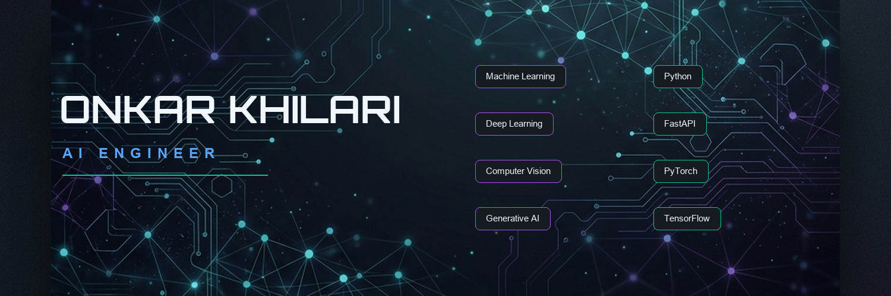

<h1>Onkar Khilari</h1>

  

  

  
  &nbsp;&nbsp;
  
  &nbsp;&nbsp;
  

---

<h2 align="center">
   Professional Introduction
</h2>

I am an Artificial Intelligence & Machine Learning specialist focused on engineering scalable, end-to-end intelligent systems. My expertise spans Deep Learning, Computer Vision, and Full Stack Engineering, allowing me to bridge the gap between complex neural architectures and production-ready applications. I design and build low-latency API pipelines using FastAPI, train robust vision models with PyTorch and TensorFlow, and integrate generative AI capabilities into modern workflows. Passionate about solving complex engineering challenges, I focus on optimizing model inference, building data ingestion pipelines, and deploying containerized solutions. I aim to build high-impact, robust systems that leverage state-of-the-art AI to address critical business and scientific challenges.

<h3 align="center">
   Career Objective
</h3>

> "To architect and deploy scalable, production-ready AI systems at a world-class technology company, leveraging computer vision and generative models to build intelligent software that solves complex real-world challenges."

---

<h2 align="center">
   Quick Information
</h2>

<table width="100%">
<tr align="center">

<td width="50%" valign="top">

<h4> Education & Specialization</h4>

<strong>B.Tech Computer Science Engineering</strong> 
Specialization in <em>Artificial Intelligence & Machine Learning</em>

</td>

<td width="50%" valign="top">

<h4> Current Focus</h4>

Developing end-to-end Computer Vision pipelines and optimizing deep neural networks for edge deployments.

</td>

</tr>

<tr align="center">

<td width="50%" valign="top">

<h4> Currently Learning</h4>

Distributed training systems, Large Language Model orchestration, and scalable cloud-based inference deployment.

</td>

<td width="50%" valign="top">

<h4> Open to Collaboration</h4>

Open-source AI libraries, machine learning research, computer vision projects, and pipeline optimizations.

</td>

</tr>
</table>

---

<h2 align="center">
   Technical Identity
</h2>

<h3 align="center">Artificial Intelligence & Machine Learning</h3>

<table align="center" border="0" cellpadding="6" cellspacing="6">
<tr align="center">

<td width="100" bgcolor="#1C2128">
 
<strong>PyTorch</strong>
</td>

<td width="100" bgcolor="#1C2128">
 
<strong>TensorFlow</strong>
</td>

<td width="100" bgcolor="#1C2128">
 
<strong>OpenCV</strong>
</td>

<td width="100" bgcolor="#1C2128">
 
<strong>scikit-learn</strong>
</td>

<td width="100" bgcolor="#1C2128">
 
<strong>Seaborn</strong>
</td>

<td width="100" bgcolor="#1C2128">
 
<strong>Pandas</strong>
</td>

<td width="100" bgcolor="#1C2128">
 
<strong>NumPy</strong>
</td>

</tr>
</table>

<h3 align="center">Backend & Systems Architecture</h3>

<table align="center" border="0" cellpadding="6" cellspacing="6">
<tr align="center">

<td width="100" bgcolor="#1C2128">
 
<strong>Python</strong>
</td>

<td width="100" bgcolor="#1C2128">
 
<strong>FastAPI</strong>
</td>

<td width="100" bgcolor="#1C2128">
 
<strong>C++</strong>
</td>

<td width="100" bgcolor="#1C2128">
 
<strong>JavaScript</strong>
</td>

<td width="100" bgcolor="#1C2128">
 
<strong>Node.js</strong>
</td>

<td width="100" bgcolor="#1C2128">
 
<strong>Express</strong>
</td>

</tr>
</table>

<h3 align="center">Databases, Cloud & DevOps</h3>

<table align="center" border="0" cellpadding="6" cellspacing="6">
<tr align="center">

<td width="100" bgcolor="#1C2128">
 
<strong>PostgreSQL</strong>
</td>

<td width="100" bgcolor="#1C2128">
 
<strong>MySQL</strong>
</td>

<td width="100" bgcolor="#1C2128">
 
<strong>Docker</strong>
</td>

<td width="100" bgcolor="#1C2128">
 
<strong>Git</strong>
</td>

<td width="100" bgcolor="#1C2128">
 
<strong>GH Actions</strong>
</td>

<td width="100" bgcolor="#1C2128">
 
<strong>Linux</strong>
</td>

<td width="100" bgcolor="#1C2128">
 
<strong>Postman</strong>
</td>

</tr>
</table>

---

<h3 align="center">
   Tools & IDEs
</h3>

<table align="center" border="0" cellpadding="6" cellspacing="6">
<tr align="center">

<td width="100" bgcolor="#1C2128">
 
<strong>Anaconda</strong>
</td>

<td width="100" bgcolor="#1C2128">
 
<strong>Kaggle</strong>
</td>

<td width="100" bgcolor="#1C2128">
 
<strong>Antigravity</strong>
</td>

<td width="100" bgcolor="#1C2128">
 
<strong>Kiro</strong>
</td>

<td width="100" bgcolor="#1C2128">
 
<strong>VS Code</strong>
</td>

<td width="100" bgcolor="#1C2128">
 
<strong>Git</strong>
</td>

<td width="100" bgcolor="#1C2128">
 
<strong>GitHub</strong>
</td>

<td width="100" bgcolor="#1C2128">
 
<strong>GitHub Desktop</strong>
</td>

<td width="100" bgcolor="#1C2128">
 
<strong>Jupyter</strong>
</td>

</tr>
</table>

---

<h3 align="center">
   Software Testing
</h3>

<table align="center" border="0" cellpadding="6" cellspacing="6">
<tr align="center">

<td width="100" bgcolor="#1C2128">
 
<strong>Playwright</strong>
</td>

<td width="100" bgcolor="#1C2128">
 
<strong>Postman</strong>
</td>

<td width="100" bgcolor="#1C2128">
 
<strong>OWASP ZAP</strong>
</td>

<td width="100" bgcolor="#1C2128">
 
<strong>Apache JMeter</strong>
</td>

<td width="100" bgcolor="#1C2128">
 
<strong>ESLint</strong>
</td>

<td width="100" bgcolor="#1C2128">
 
<strong>MySQL</strong>
</td>

</tr>
</table>

---

<h2 align="center">
   GitHub Analytics
</h2>

  

  <picture>
    <source media="(prefers-color-scheme: dark)" srcset="https://raw.githubusercontent.com/khilarionkar05/khilarionkar05/output/github-contribution-grid-snake-dark.svg">
    <source media="(prefers-color-scheme: light)" srcset="https://raw.githubusercontent.com/khilarionkar05/khilarionkar05/output/github-contribution-grid-snake.svg">
    
  </picture>

---

<h2 align="center">
   LeetCode Analytics
</h2>

  

---

<h2 align="center">
   Professional Profiles &amp; Ecosystem
</h2>

<h3 align="center">Connect &amp; Networks</h3>

  
  &nbsp;
  

<h3 align="center">Competitive Coding &amp; Data Science</h3>

  
  &nbsp;
  
  &nbsp;
  
  &nbsp;
  

